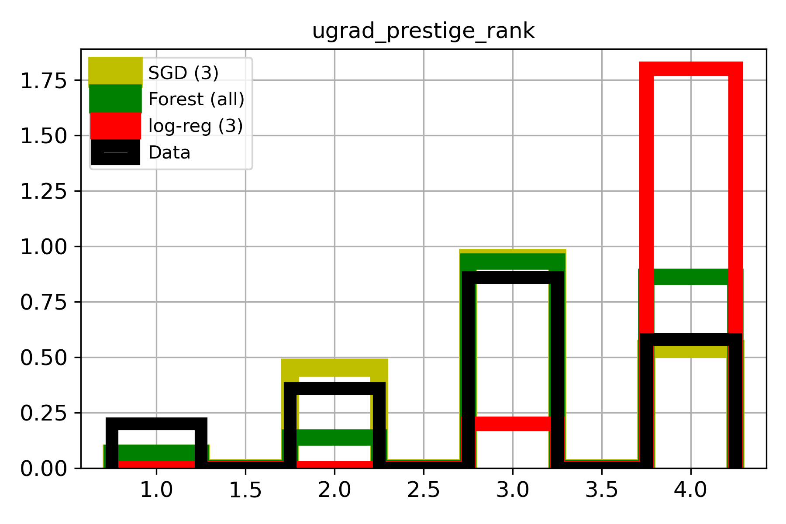

# Machine Learning Projects

# International graduate student admission to US schools (Mar 2021 - April 2021)
Working with the [USA-College Admission dataset](https://www.kaggle.com/vik2012kvs/usacollege-admission/)

I used this simple dataset to practice data visualization and machine learning using python and scikit-learn. See the [writeup](
USA_College_Admission/README.md) and [jupyter notebook](USA_College_Admission/admissions_data_exp_and_model_training.ipynb) for more details.

The small dataset contains a variety of student characteristics and whether they were admitted. We might imagine a few uses for predictive models:
- student-facing tool to predict admission chances and inform applications
- reviewer-facing tool to sort applications
- ugrad-instructor-facing tool for identifying students to encourage to apply to grad school

## Overview
This is a small (400x7) dataset. It appears to be artificial, but may be real data (or subset) without a source given. 

I identify a few unsurprising (weak) predictors of admission (GPA, GRE, undegrad prestige), and test a few simple classification models. 

The models do not have satisfactory accuracy, and the more accurate (Random Forest and Logistic Regression) classifiers show signs of bias which could have unintended inequitable consequences.

## Features of admitted class for data and models
 . 

