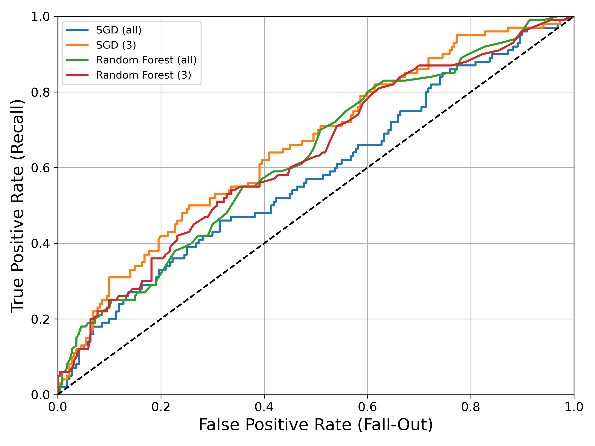

# Basic admissions dataset
Working with the [USA-College Admission dataset](https://www.kaggle.com/vik2012kvs/usacollege-admission/)

This project is currently being worked on. See the [jupyter notebook](admissions_data_exp_and_model_training.ipynb) for implementation details.

## Overview
This is a small (400x7) dataset. It appears to be artificial, but may be real data (or subset) without a source given. 

## Data Exploration
Given the small number of attributes and instances, plus simple datatypes, data exploration is straightforward.

### Looking at raw data
From df.info() and histograms, we can see that the data does not appear to need cleaning (unless very poor missing data placeholders were used)

Initial observations:
- significant portion of GRE and (esp.) GPA scores at max values
- even spread of race, gender, and socioeconomic rank
- about a third admitted

### Correlation observations

Note: range of correlations is (-.1 to 0.4)
- admission correlates with common explicit application metrics (GPA, GRE)
- also correlated with prestige of undergrad instition, which is sometimes an explicit metric
- high correlation between GPA and GRE score -- not suprising
- no strong correlations between these four (admission, GRE, GPA, ugrad rank) and other attributes

### admitted vs not-admitted
Exploring the distribution of each attribute by admission status:
- GPA < 3.5 make up a larger portion of non-admitted students, but no clear cut-off
- GRE < 600 make up a smaller portion of admitted students; no clear cut-off
- admitted students mostly from higher-prestige ugrads
- approximate equality across gender and race

Also considering distributions by race and gender, most other attributes show less obvious differences, given the small sample size.

## Data preparation
I split the race attribute into separate attributes for each race, allowing for sensible correlations and generally easier bookkeeping.

## Model selection
**Stochastic Gradient Descent**
- poor performance overall
- generally appears only slightly better than random guess
- no clear "good" threshold value
**Random Forest**
- slightly better than SGD
- still not good

### Comparing populations by model
Assuming we were satisfied with the classifier's performance, an important check would be to consider how its predictions vary from data, across attributes.
For example, does the model expect more men to be admitted than women? If so, care must be taken with the outputs to avoid inequity.
- student-facing tool to predict admission chances and inform applications
- reviewer-facing tool to sort applications
- ugrad-instructor-facing tool for identifying students to encourage to apply to grad school

Observations:
- both models have poor precision
Random forest more strongly favors <> than reality or SGD:
- GPA > 3.50
- GRE > 700
- high undergrad institution prestige
- Asian and Hispanic students over African-American ones
Stochastic Gradient Descent generally places more preference on middle-ground GPA, ugrad prestige, and socioeconomic rank, but otherwise does not seem to have systemic errors

## Generalization 

## Summary and Outlook
Thus far, a classification algorithm with satisfactory performance has not been found. In addition to poor performance, the random forest model shows worrisome preferences which may reinforce existing disparities if used improperly.
