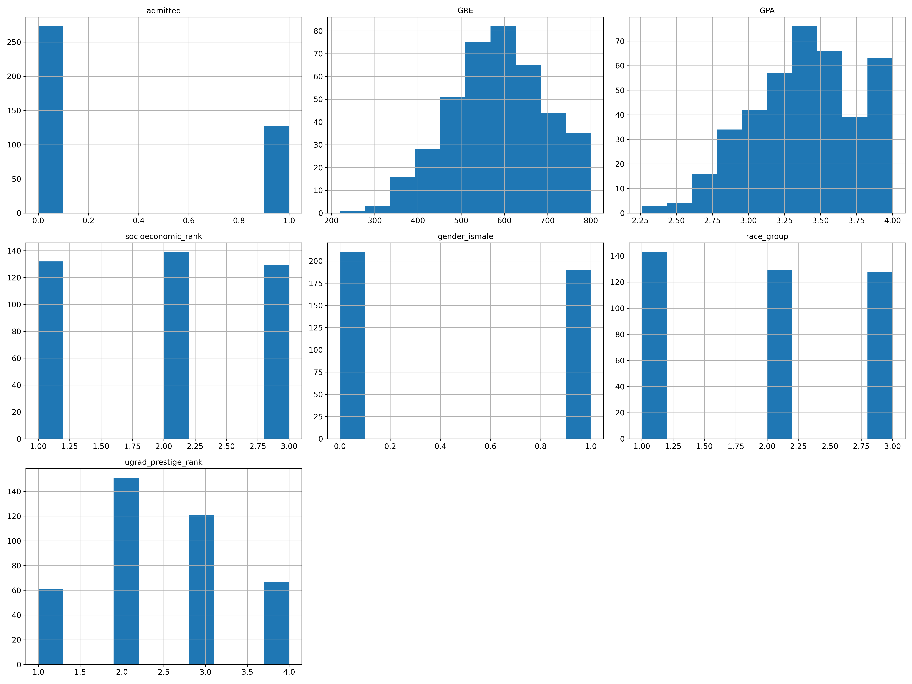
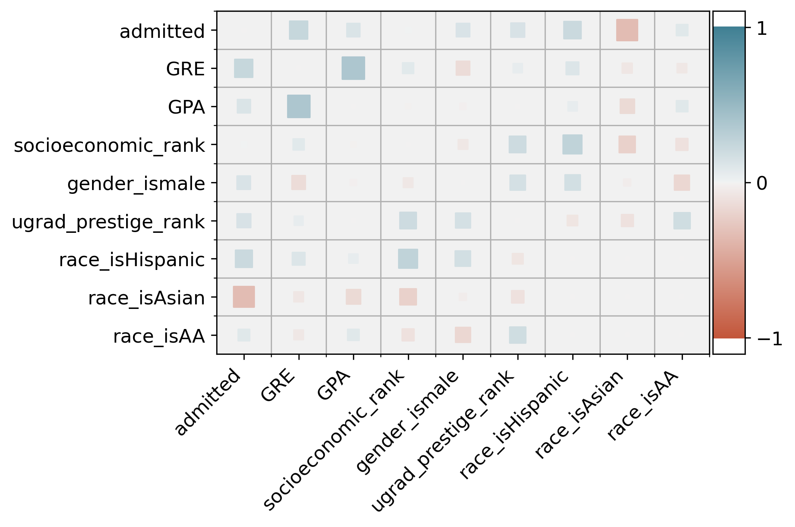

# Basic admissions dataset
Working with the [USA-College Admission dataset](https://www.kaggle.com/vik2012kvs/usacollege-admission/)

This project is currently being worked on. See the [jupyter notebook](admissions_data_exp_and_model_training.ipynb) for implementation details.

## Overview
This is a small (400x7) dataset. It appears to be artificial, but may be real data (or subset) without a source given. 

## Methods

### Data Exploration
Given the small number of attributes and instances, plus simple datatypes, data exploration is straightforward. 

#### Looking at raw data
From df.info() and histograms, we can see that the data does not appear to need cleaning (unless very poor missing data placeholders were used)

Initial observations:
- significant portion of GRE and (esp.) GPA scores at max values
- even spread of race, gender, and socioeconomic rank
- about a third admitted

#### Correlation observations

Note: range of correlations is (-.33 to 0.38)
- admission correlates with common explicit application metrics (GPA, GRE)
- also correlated with prestige of undergrad instition, which is sometimes an explicit metric
- correlated with "being male" at similar strength to GPA
- high correlation between GPA and GRE score -- not suprising
- moderate correlation between socioeconomic and prestige -- also to be expected
- negative correlation between "being male" and GRE scores -- at least in physics applicants, I believe the opposite is true
- moderate negative correlation between "being Asian" and admission; but, also smaller (-) with application metrics

#### admitted vs not-admitted
Exploring the distribution of each attribute by admission status:
- GPA < 3.25 make up a larger portion of non-admitted students
- GRE > 650 make up a larger portion of admitted students (also, possible cut-off ~400)
- lowest ugrad prestige rank make up a larger portion of non-admitted students
- small portion of admitted students are Asian (and vice versa)

Also considering distributions by race and gender, most other attributes show less obvious differences, given the small sample size.

### Data preparation
I split the race attribute into separate attributes for each race, allowing for sensible correlations and generally easier bookkeeping.

### Model selection 

### Generalization 

### Summary and Outlook
