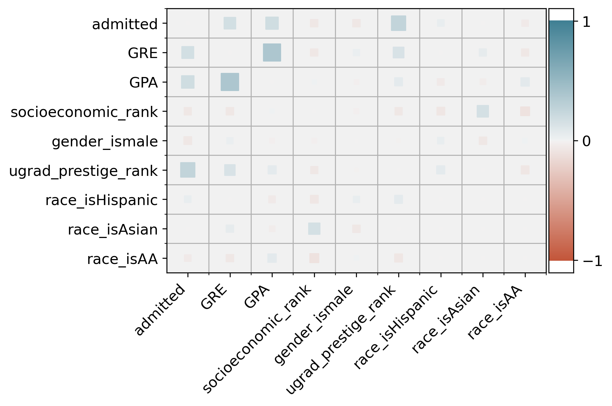
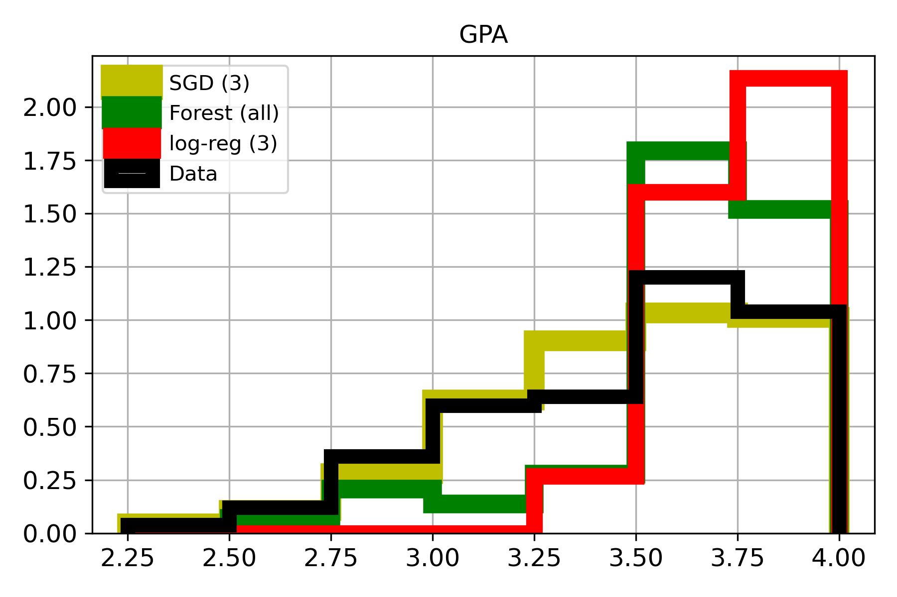

# Basic admissions dataset
Working with the [USA-College Admission dataset](https://www.kaggle.com/vik2012kvs/usacollege-admission/)

I used this simple dataset to practice data visualization and machine learning using python and scikit-learn. See the [jupyter notebook](admissions_data_exp_and_model_training.ipynb) for implementation details.

The data contains a variety of student characteristics and whether they were admitted. We might imagine a few uses for predictive models:
- student-facing tool to predict admission chances and inform applications
- reviewer-facing tool to sort applications
- ugrad-instructor-facing tool for identifying students to encourage to apply to grad school

## Overview
This is a small (400x7) dataset. It appears to be artificial, but may be real data (or subset) without a source given. 

I identify a few unsurprising (weak) predictors of admission (GPA, GRE, undegrad prestige), and test a few simple classification ML models. 

The models are only slightly better than random, and the more accurate (Random Forest and Logistic Regression) classifiers show signs of bias which could have unintended inequitable consequences.

## Data Exploration
Given the small number of attributes and instances, plus simple datatypes, data exploration is straightforward.

### Looking at raw data
From df.info() and histograms, we can see that the data does not appear to need cleaning (unless very poor missing data placeholders were used)

Initial observations:
- significant portion of GRE and (esp.) GPA scores at max values
- even spread of race, gender, and socioeconomic rank
- about a third admitted

### Correlation observations

Note: range of correlations is (-.1 to 0.4)
- admission correlates with common explicit application metrics (GPA, GRE)
- also correlated with prestige of undergrad instition, which is sometimes an explicit metric
- high correlation between GPA and GRE score -- not suprising
- no strong correlations between these four (admission, GRE, GPA, ugrad rank) and other attributes

### admitted vs not-admitted
Exploring the distribution of each attribute by admission status:
- GPA < 3.5 make up a larger portion of non-admitted students, but no clear cut-off
- GRE < 600 make up a smaller portion of admitted students; no clear cut-off
- admitted students mostly from higher-prestige ugrads
- approximate equality across gender and race

Also considering distributions by race and gender, most other attributes show less obvious differences, given the small sample size.
GPA-GRE scatter distribution has no clear separation by admission, gender, or race 

## Data preparation
I split the race attribute into separate attributes for each race, allowing for sensible correlations and generally easier bookkeeping.

For each model, I considered training with the full feature set and only the three most-correlated features often used explicitly in admissions (GRE, GPA, ugrad rank).

## Model selection
**Stochastic Gradient Descent**

Training on all features:
- poor performance overall
- generally appears only slightly better than random guess
- no clear "good" threshold value
- explicit features (esp. prestige) given high weight, but also moderate weight to race = African-American over others

Training on 3 "best" features:
- markedly better performance, but still unsatisfactory
- strong reliance on ugrad_prestige_rank as predictor

**Random Forest**
- slightly better than SGD (all), similar to SGD (3)
- minimal difference between using all features or "best" 3
- still not good

**Logistic Regression**
- slightly better than other models
- functions best using "best" 3 features, by a small margin
- strong reliance on ugrad_prestige_rank as predictor
- performance still not particularly good

### Comparing populations by model
Assuming we were satisfied with the classifier's performance, an important check would be to consider how its predictions vary from data, across attributes.
For example, does the model expect more men to be admitted than women? If so, care must be taken with the outputs to avoid inequity.

Observations:

All three models have poor precision

Random forest more strongly favors <> than reality (or SGD):
- GPA > 3.50
- GRE > 700
- high undergrad institution prestige
- Asian and Hispanic students over African-American ones

Logistic regression quite strongly favors <> than reality (or SGD):
- GPA > 3.5 (cutting off below 3.25)
- GRE > 700 (cutting off below 500)
- high undergrad institution prestige (admitting few 3's and none below)
- higher socioeconomic rank

Stochastic Gradient Descent generally places slightly more preference on middle-ground GPA, ugrad prestige, and socioeconomic rank, but otherwise does not seem to have systemic errors.

Note that in real data, explicit metrics may be more highly correlated with race, gender, and socioeconomic rank. This could potentially lead the models to exclude marginalized groups while ostensibly treating them equally.

## Generalization 

## Summary and Outlook
Thus far, a classification algorithm with satisfactory performance has not been found. In addition to poor performance, the random forest and logistics regression models show worrisome preferences which may reinforce existing disparities if used improperly.

For this dataset, I conclude that classification algorithms should not be relied upon, even only as support for human decisions. 
